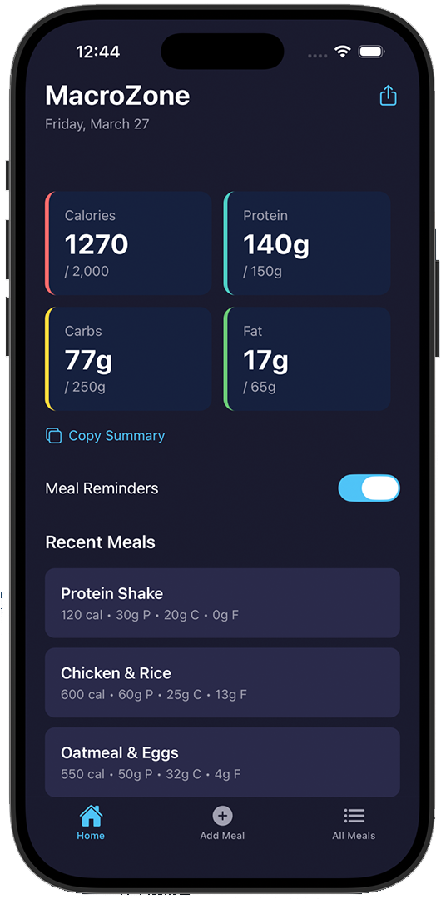

# MacroZone - Health App

A macro tracking app built with React Native and Expo. Track your daily meals and monitor your macros (calories, protein, carbs, fat) with a clean, modern UI.

<p align="center">
  
</p>

## Features

- Add meals with calorie and macro information
- Track daily totals for calories, protein, carbs, and fat
- View all meals or recent meals on the home screen
- Share and copy meal data
- Haptic feedback for interactions
- Daily reminder notifications (iOS)
- Data persistence with AsyncStorage
- Tab-based navigation with a modern UI

## Tech Stack

- [React Native](https://reactnative.dev/) with [Expo](https://expo.dev/) (SDK 55)
- [Expo Router](https://docs.expo.dev/router/introduction/) (file-based routing)
- [AsyncStorage](https://react-native-async-storage.github.io/async-storage/) for local data persistence
- [Expo Notifications](https://docs.expo.dev/versions/latest/sdk/notifications/) for reminders
- [Expo Haptics](https://docs.expo.dev/versions/latest/sdk/haptics/) for tactile feedback
- TypeScript

```bash
git clone https://github.com/mtisya/Health_App.git
cd macrozone
npm install
```

### Run the App

```bash
npx expo start
```

Scan the QR code with Expo Go (Android) or the Camera app (iOS) to run on your device.


## License

MIT
